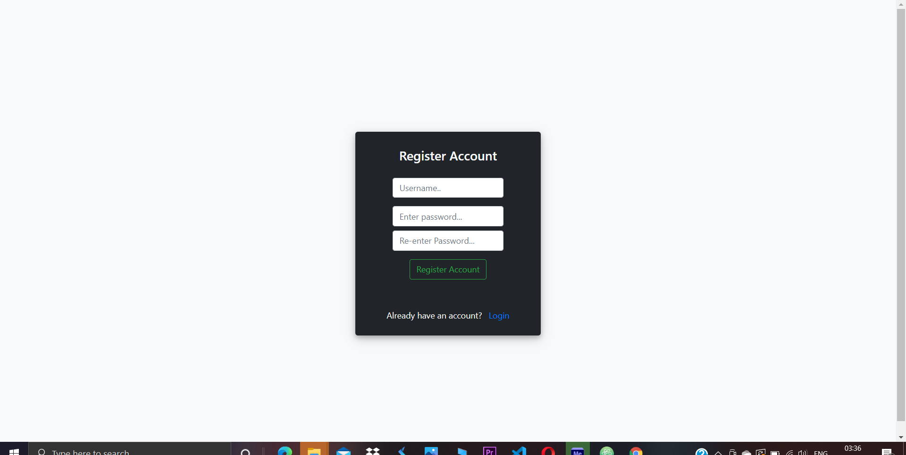
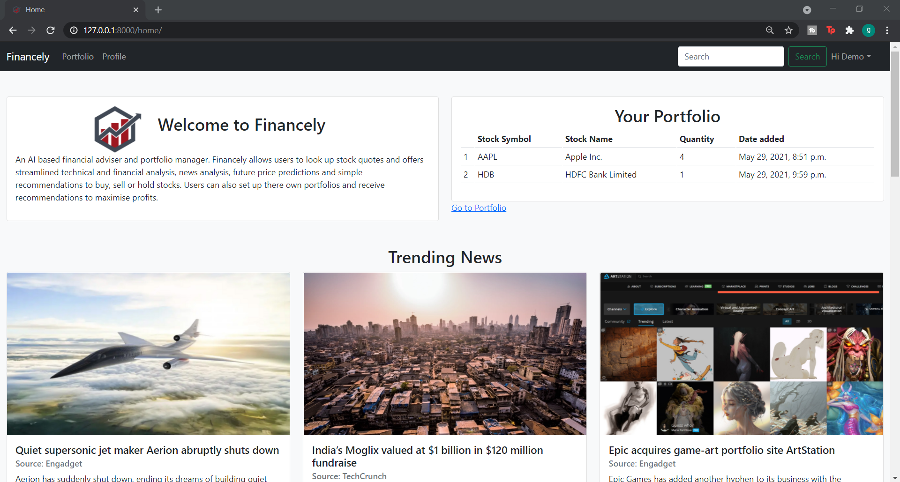
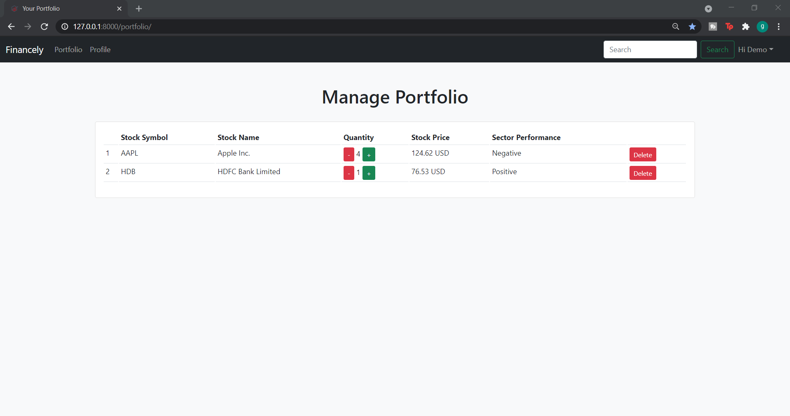
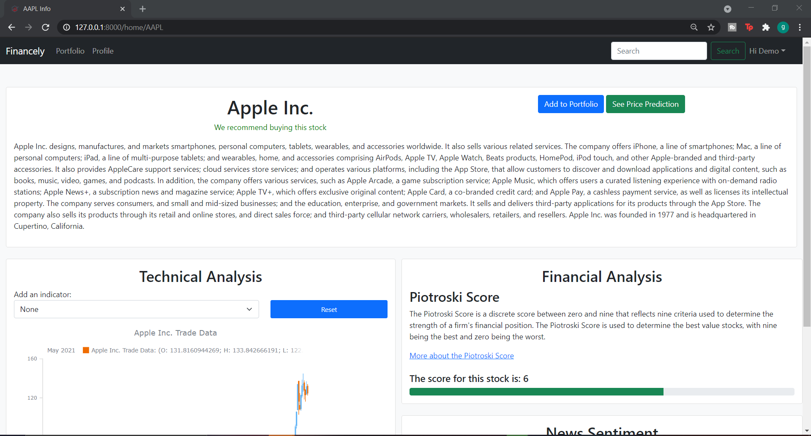
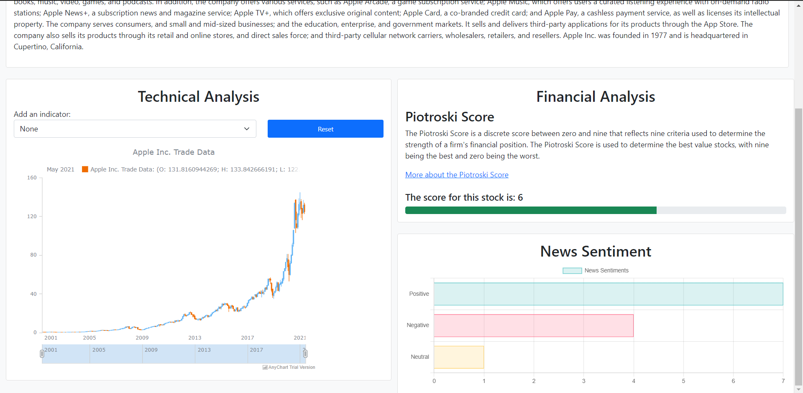
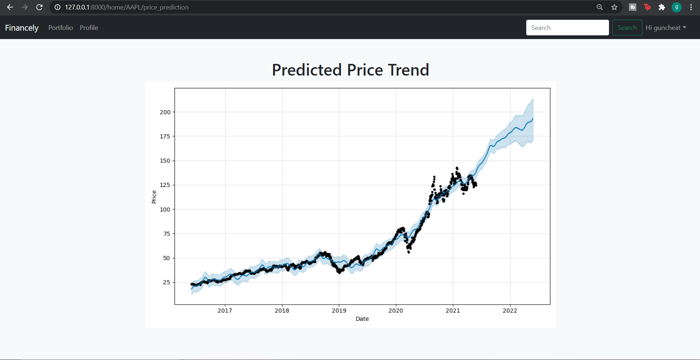

# Financely

<center></center>
Financely is an AI based financial adviser and user portfolio management system. The aim of this project is to help people become financially independent by demystifying trading and the stock market and making them more accessible to people without a formal education in the field.

# Setting up and running the project

1. Fork the repo and clone it
```
git clone https://github.com/EnigmAI/Financely.git
cd financely
```
2. Activate your conda or virtual Python environment
3. To download the required packages run the commands below
```
pip install -r requirements.txt
```
4. Download our sentiment analysis model from <a href='https://drive.google.com/file/d/1vGN0481ovU6mQZkgKO2lLAGMKnXVbufi/view?usp=sharing'>here</a> and place it inside the directory `Financely/basic_app/`

5. After the above setup, run the following commands
```
python manage.py migrate
python manage.py makemigrations basic_app
python manage.py migrate
```
6. To start the backend server run the following command
```
python manage.py runserver
```
7. Open your browser and navigate to the url below
```
http://localhost:8000
```

# Models and Analysis

1. <strong>Technical Analysis Indicators</strong>:
    - RSI
    - MACD
    - EMA
    - SMA
    - OBV
    - Pivot Points
2. <strong>Financial Analysis</strong> - Piotroski Score
3. <strong>Price Forecasting</strong> - Facebook Prophet Model
4. <strong>Sentiment Analysis</strong> - Fine-tuned BERT model

# Preview

Project Demo Video Link - https://drive.google.com/file/d/1ehs1m1HP4O2smAXmWmnmH4Y-k36jBmf0/view?usp=sharing

|  |  |
|:------------------|:------------------|
|  |  |
|  |  |
